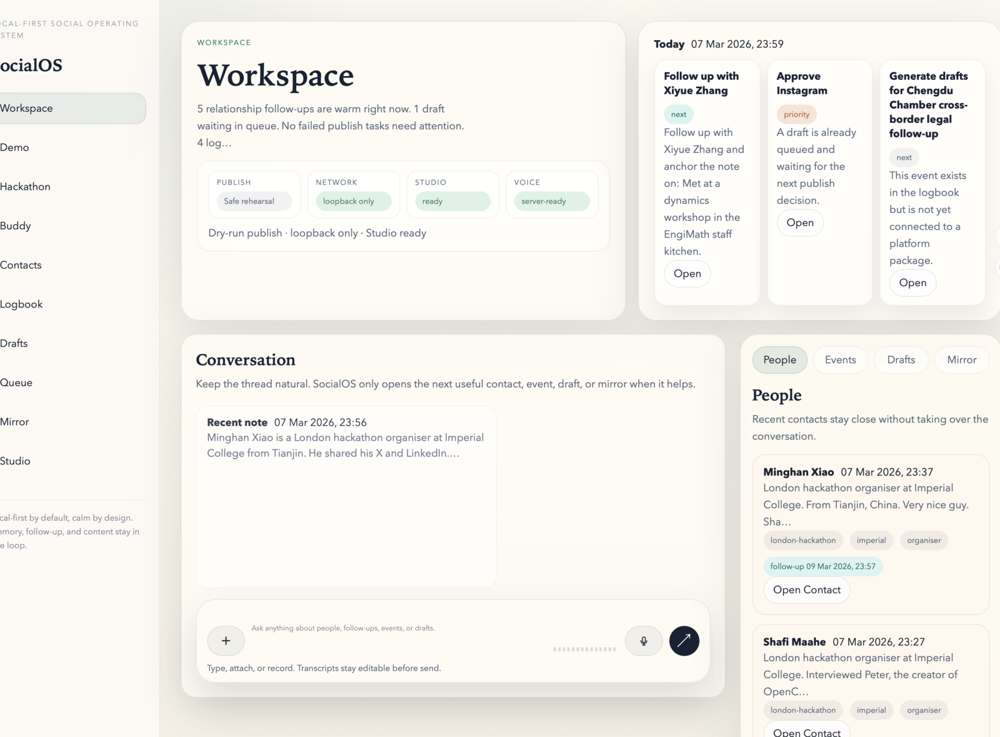
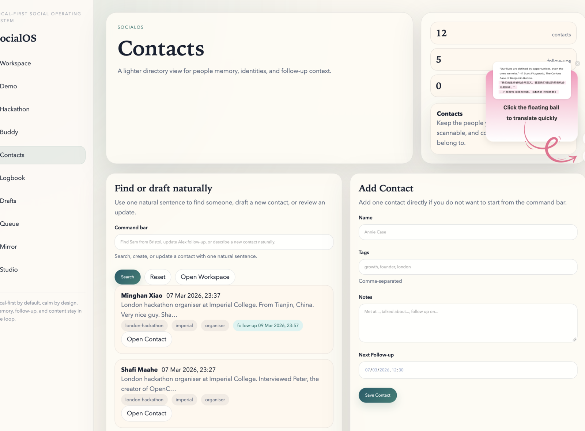
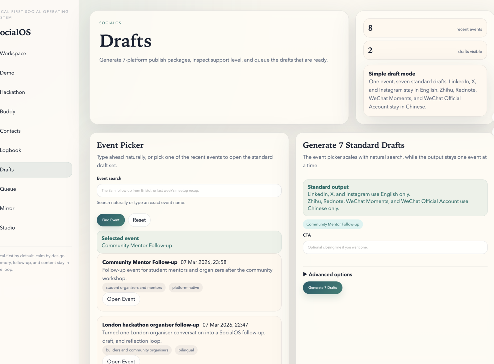
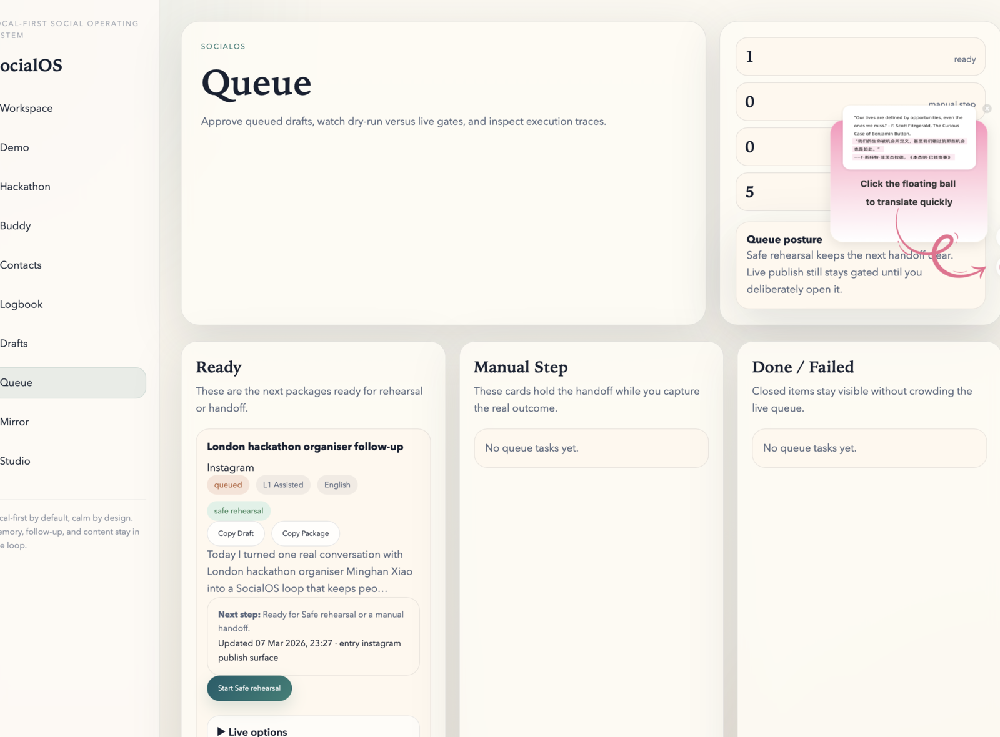
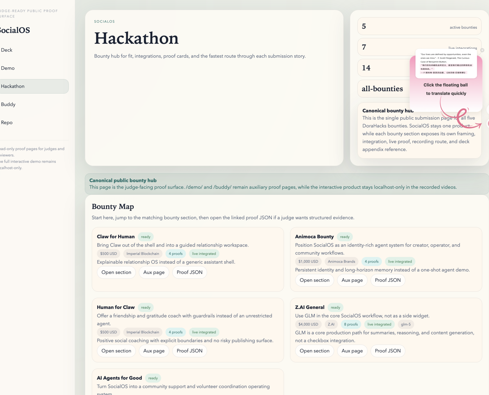
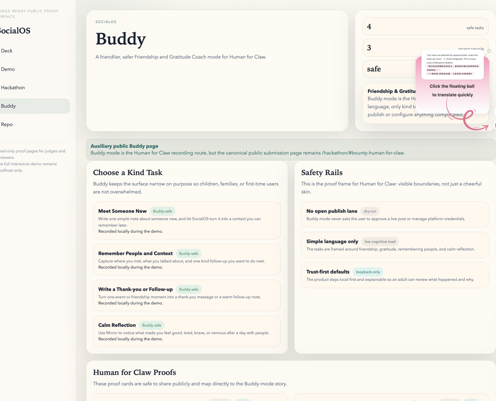
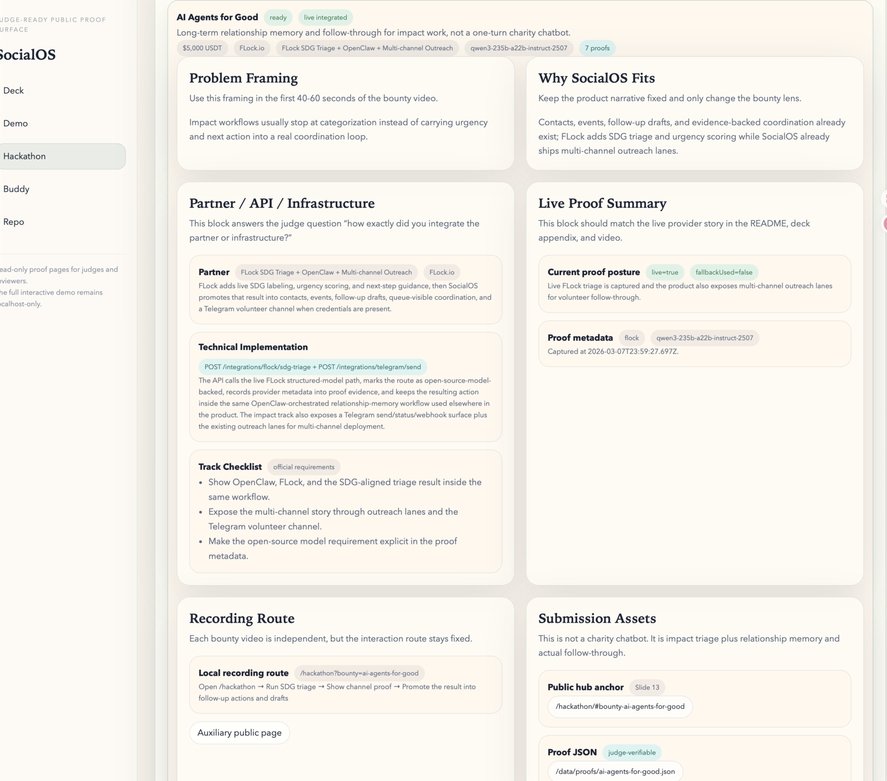

# SocialOS Public Evidence

This folder contains curated, stable evidence copied out of volatile local runtime paths.

## Demo Assets
- Demo GIF: `socialos/docs/evidence/socialos-demo.gif`
- Screenshot 1: `socialos/docs/evidence/socialos-demo-step01.png`
- Screenshot 2: `socialos/docs/evidence/socialos-demo-step02-contacts.png`
- Screenshot 3: `socialos/docs/evidence/socialos-demo-step04.png`
- Screenshot 4: `socialos/docs/evidence/socialos-demo-step08.png`
- Public Hub Screenshot: `socialos/docs/evidence/hackathon-public-hub.png`
- Buddy Proof Screenshot: `socialos/docs/evidence/buddy-public-proof.png`
- AI Agents for Good Channel Screenshot: `socialos/docs/evidence/ai-agents-for-good-telegram-proof.png`

### Preview

## Representative Runtime Evidence
- Sample run report (Markdown): `socialos/docs/evidence/sample-run-report.md`
- Sample run report (JSON): `socialos/docs/evidence/sample-run-report.json`
- Sample digest snapshot: `socialos/docs/evidence/sample-digest.md`
- Generated validation snapshot: `socialos/docs/evidence/LATEST_VALIDATION.md`

## Hackathon Proof Snapshots
- Overview snapshot: `socialos/docs/evidence/hackathon-overview.json`
- All proofs: `socialos/docs/evidence/hackathon-proofs-all.json`
- `Claw for Human` proofs: `socialos/docs/evidence/hackathon-proofs-claw-for-human.json`
- `Animoca` proofs: `socialos/docs/evidence/hackathon-proofs-animoca.json`
- `Human for Claw` proofs: `socialos/docs/evidence/hackathon-proofs-human-for-claw.json`
- `Z.AI General` proofs: `socialos/docs/evidence/hackathon-proofs-z-ai-general.json`
- `AI Agents for Good` proofs: `socialos/docs/evidence/hackathon-proofs-ai-agents-for-good.json`
- GLM generation proof: `socialos/docs/evidence/hackathon-glm-generate.json`
- Workspace GLM proof: `socialos/docs/evidence/hackathon-workspace-zai.json`
- Draft generation GLM proof: `socialos/docs/evidence/hackathon-drafts-zai.json`
- FLock SDG proof: `socialos/docs/evidence/hackathon-flock-triage.json`
- Telegram status proof: `socialos/docs/evidence/hackathon-telegram-status.json`
- Telegram send proof: `socialos/docs/evidence/hackathon-telegram-send.json`
- Summary note: `socialos/docs/evidence/hackathon-proof-summary.md`

## Why This Exists
- Public reviewers need credible runtime proof.
- Future maintainers and AI/agents need stable references.
- Rolling local files such as `reports/LATEST.md` and `reports/runs/*` remain local and are intentionally not part of the public repo contract.
